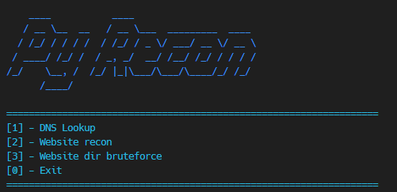

<h1 align="center">😈 Python Recon</h1>

<p align="center"> </img></p>

The "Py Recon" project is a tool developed in Python for conducting reconnaissance and exploration of web servers. With features for performing DNS lookup, website reconnaissance, and directory bruteforcing, the tool offers a flexible and straightforward way to explore and analyze web targets. Leveraging libraries such as Requests and Fake User-Agent, the project provides a robust solution for gathering information about web servers, aiding in vulnerability identification and configuration analysis. Additionally, the project encourages contributions from the community for ongoing improvements, ensuring it can be adapted and enhanced for various use cases.


<p>Some text</p>

## 🔑 Features

- **DIR bruteforce**: Using a wordlist from <a href="https://github.com/ricardolongatto/dnsrato">DNS Rato</a> this program can bruteforce an given host, to search for specific subdomains.
- **Custom useragent**: This program uses a custom user agent, the website get the requests as Safari from Mac OS.
- **Tor proxies**: You can use tor proxies if you want, to make website bruteforce or recon.
- **DNS lookup**: Search for the host IP and port

## 🏎️ Usage<br></br>

```python
python dns_python https://somewebsite.com
```

## 📫 Contributions<br></br>

Contributions are welcome! Feel free to open issues, submit pull requests, or provide feedback. Together, we can make this project even better.<br></br>


## 📝 License

This project is licensed under the MIT License - see the [LICENSE](LICENSE) file for details.<br></br>


## 🦄 Author

<table>
  <tr>
    <td align="center">
      <a href="#" title="author image">
        <br>
        <sub>
          <b>At0mic-l1mbo</b>
        </sub>
      </a>
    </td>
  </tr>
</table>
